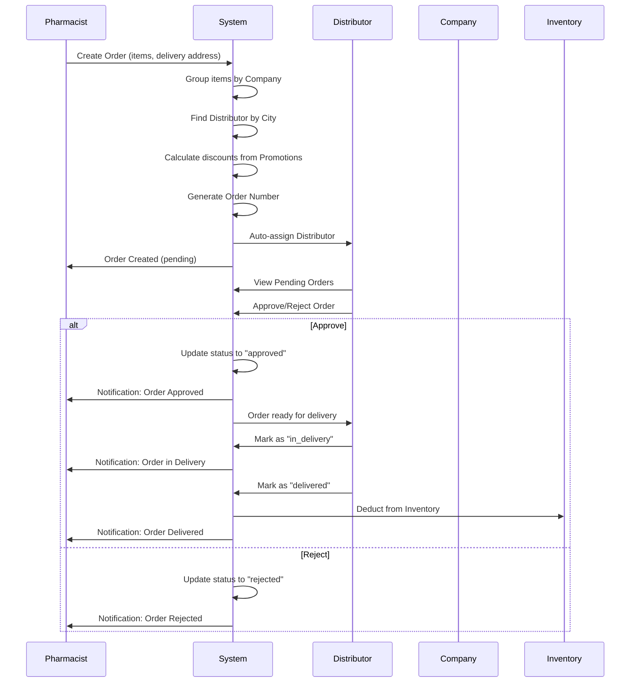
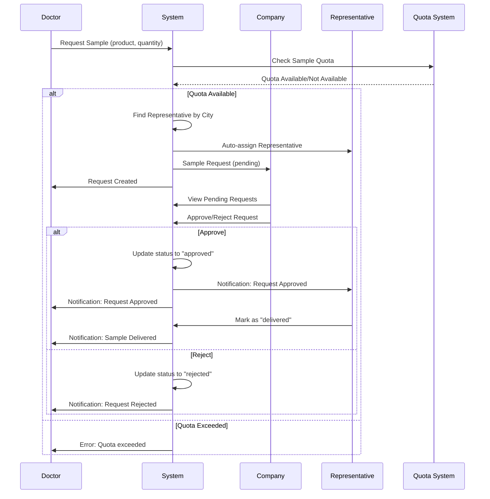
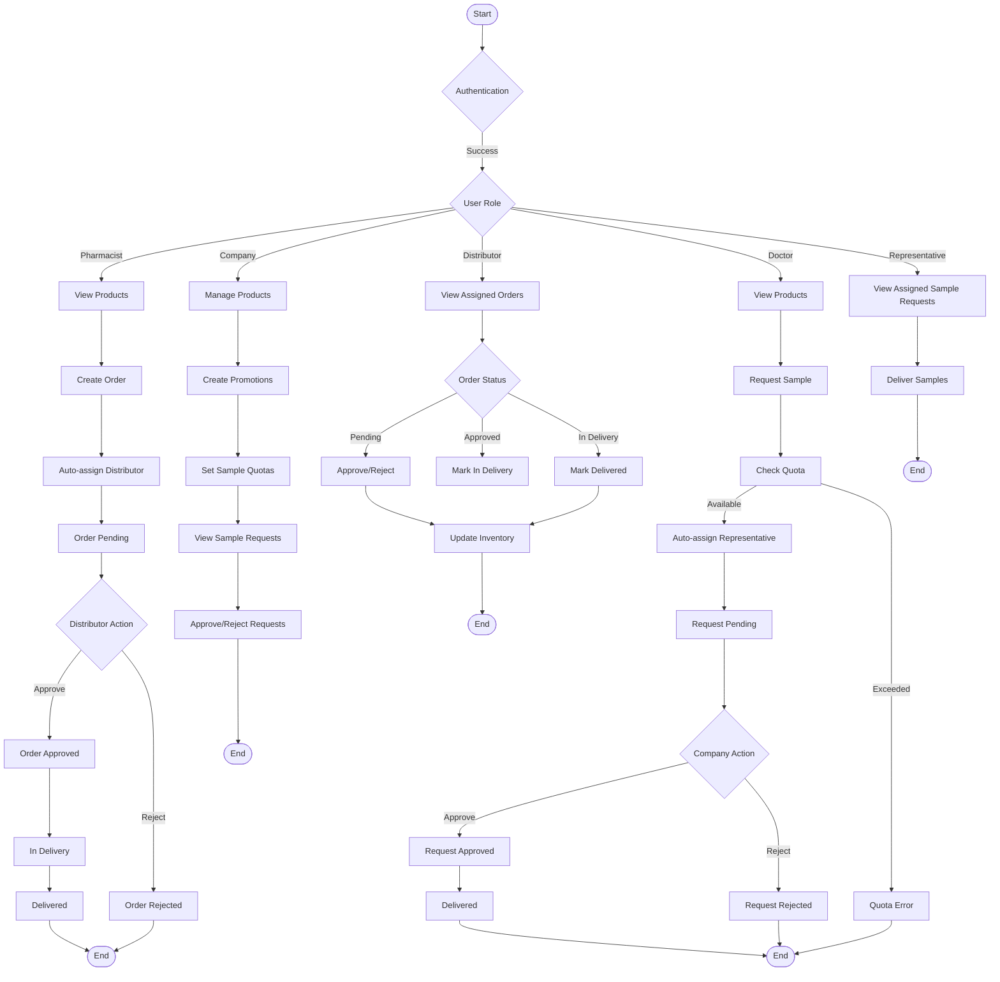

# Pharmaceutical System Diagrams

## Sequence Diagram - Order Flow



## Sequence Diagram - Sample Request Flow



## Activity Diagram - Overall System Flow



## Key System Components

### 1. Order Management Flow
- **Pharmacist**: Creates order → System groups by company → Auto-assigns distributor → Order pending
- **Distributor**: Approves/rejects → Updates status → Delivers → Inventory deducted
- **Status Flow**: pending → approved → in_delivery → delivered OR pending → rejected/cancelled

### 2. Sample Request Flow  
- **Doctor**: Requests sample → Quota check → Auto-assigns representative → Request pending
- **Company**: Approves/rejects → Representative delivers
- **Quota System**: Monthly limits per doctor with cooldown periods

### 3. Promotion System
- **Company**: Creates promotions (percentage/buyXgetY) for distributors/pharmacists
- **Distributor**: Can clone and modify company promotions
- **Types**: Percentage discount or Buy X Get Y free

### 4. Inventory Management
- **Distributor**: Manages stock levels
- **Auto-deduction**: When orders are delivered
- **Low stock alerts**: When quantity falls below threshold

### 5. Auto-assignment Logic
- **Orders**: Distributor assigned based on pharmacist's city and company-distributor mapping
- **Sample Requests**: Representative assigned based on doctor's city and company-representative mapping

### 6. Notification System
- Order status updates
- Sample request updates  
- New promotions
- Low stock alerts
- Account status changes

## Database Relationships

```
Users → Profiles (Company/Distributor/Pharmacist/Doctor/Representative)
Company ↔ Distributor (Many-to-Many with City mapping)
Orders → Order Items → Products
Sample Requests → Products → Company
Promotions → Promotion Products OR BuyXGetY
Inventory → Products → Distributor
```

## Status Transitions

### Order Status:
- **pending**: Initial state
- **approved**: Distributor approved
- **in_delivery**: Being delivered
- **delivered**: Completed
- **rejected**: Distributor rejected
- **cancelled**: Pharmacist cancelled

### Sample Request Status:
- **pending**: Initial state
- **approved**: Company approved
- **delivered**: Representative delivered
- **rejected**: Company rejected or Doctor cancelled