# Pharmaceutical System - UML Class Diagram

```mermaid
classDiagram
    class User {
        +uuid id
        +string email
        +string passwordHash
        +UserRole role
        +string fullName
        +string phone
        +uuid cityId
        +UserStatus status
        +timestamp createdAt
        +timestamp updatedAt
    }

    class CompanyProfile {
        +uuid id
        +uuid userId
        +string companyName
        +string commercialRegister
        +string taxNumber
        +string logoUrl
        +timestamp createdAt
    }

    class DistributorProfile {
        +uuid id
        +uuid userId
        +string companyName
        +string commercialRegister
        +string taxNumber
        +timestamp createdAt
    }

    class PharmacistProfile {
        +uuid id
        +uuid userId
        +string pharmacyName
        +string licenseNumber
        +timestamp createdAt
    }

    class DoctorProfile {
        +uuid id
        +uuid userId
        +string licenseNumber
        +uuid specializationId
        +timestamp createdAt
    }

    class RepresentativeProfile {
        +uuid id
        +uuid userId
        +uuid companyId
        +uuid cityId
        +timestamp createdAt
    }

    class City {
        +uuid id
        +string nameAr
        +string nameEn
    }

    class CompanyDistributor {
        +uuid id
        +uuid companyId
        +uuid distributorId
        +uuid cityId
        +CompanyDistributorStatus status
        +timestamp assignedAt
    }

    class Product {
        +uuid id
        +uuid companyId
        +string nameAr
        +string nameEn
        +string description
        +decimal price
        +string imageUrl
        +uuid categoryId
        +uuid drugGroupId
        +ProductStatus status
        +timestamp createdAt
    }

    class Order {
        +uuid id
        +string orderNumber
        +uuid pharmacistId
        +uuid companyId
        +uuid distributorId
        +uuid cityId
        +OrderStatus status
        +decimal totalAmount
        +PaymentMethod paymentMethod
        +string deliveryAddress
        +string notes
        +string rejectionReason
        +timestamp approvedAt
        +timestamp deliveredAt
        +timestamp createdAt
        +timestamp updatedAt
    }

    class OrderItem {
        +uuid id
        +uuid orderId
        +uuid productId
        +string productName
        +int quantity
        +decimal unitPrice
        +uuid promotionProductId
        +decimal discountAmount
        +decimal subtotal
    }

    class SampleRequest {
        +uuid id
        +uuid doctorId
        +uuid productId
        +uuid companyId
        +uuid representativeId
        +SampleRequestStatus status
        +int quantity
        +string deliveryAddress
        +string rejectionReason
        +timestamp approvedAt
        +timestamp deliveredAt
        +timestamp createdAt
        +timestamp updatedAt
    }

    class SampleQuota {
        +uuid id
        +uuid companyId
        +uuid productId
        +int maxPerDoctor
        +int cooldownDays
        +boolean isActive
        +timestamp createdAt
    }

    class Promotion {
        +uuid id
        +uuid companyId
        +uuid distributorId
        +uuid parentPromotionId
        +string title
        +string description
        +PromotionType type
        +PromotionLevel level
        +PromotionTargetType targetType
        +timestamp startsAt
        +timestamp endsAt
        +string imageUrl
        +boolean isActive
        +timestamp createdAt
    }

    class PromotionProduct {
        +uuid id
        +uuid promotionId
        +uuid productId
        +decimal discountPercent
    }

    class PromotionBuyXGetY {
        +uuid id
        +uuid promotionId
        +uuid buyProductId
        +int buyQuantity
        +uuid freeProductId
        +int freeQuantity
    }

    class DistributorInventory {
        +uuid id
        +uuid distributorId
        +uuid productId
        +int quantityAvailable
        +int lowStockThreshold
        +timestamp lastUpdated
    }

    class InventoryMovement {
        +uuid id
        +uuid distributorId
        +uuid productId
        +InventoryMovementType type
        +int quantity
        +uuid referenceId
        +uuid createdBy
        +timestamp createdAt
    }

    class Notification {
        +uuid id
        +uuid userId
        +string type
        +string title
        +string body
        +uuid relatedId
        +NotificationRelatedType relatedType
        +timestamp readAt
        +timestamp createdAt
    }

    class Message {
        +uuid id
        +uuid conversationId
        +uuid parentMessageId
        +uuid senderId
        +uuid receiverId
        +uuid relatedProductId
        +string body
        +string attachmentUrl
        +timestamp readAt
        +timestamp createdAt
    }

    class AuditLog {
        +uuid id
        +uuid userId
        +string action
        +string entityType
        +uuid entityId
        +jsonb oldData
        +jsonb newData
        +string ipAddress
        +string userAgent
        +timestamp createdAt
    }

    %% Relationships
    User "1" -- "1" CompanyProfile : has
    User "1" -- "1" DistributorProfile : has
    User "1" -- "1" PharmacistProfile : has
    User "1" -- "1" DoctorProfile : has
    User "1" -- "1" RepresentativeProfile : has
    User "1" -- "1" City : located_in

    CompanyProfile "1" -- "*" CompanyDistributor : has
    DistributorProfile "1" -- "*" CompanyDistributor : has
    City "1" -- "*" CompanyDistributor : serves

    CompanyProfile "1" -- "*" Product : produces
    Product "1" -- "*" OrderItem : included_in
    Product "1" -- "*" SampleRequest : requested_in
    Product "1" -- "*" SampleQuota : has_quota_for
    Product "1" -- "*" PromotionProduct : in_promotion
    Product "1" -- "*" PromotionBuyXGetY : buy_product
    Product "1" -- "*" PromotionBuyXGetY : free_product
    Product "1" -- "*" DistributorInventory : in_inventory

    Order "1" -- "*" OrderItem : contains
    PharmacistProfile "1" -- "*" Order : creates
    DistributorProfile "1" -- "*" Order : handles
    CompanyProfile "1" -- "*" Order : receives

    DoctorProfile "1" -- "*" SampleRequest : creates
    RepresentativeProfile "1" -- "*" SampleRequest : delivers
    CompanyProfile "1" -- "*" SampleRequest : approves

    Promotion "1" -- "*" PromotionProduct : has_discounts
    Promotion "1" -- "1" PromotionBuyXGetY : has_buyxgety
    Promotion "1" -- "*" Promotion : child_of

    DistributorProfile "1" -- "*" DistributorInventory : manages
    DistributorProfile "1" -- "*" InventoryMovement : tracks

    User "1" -- "*" Notification : receives
    User "1" -- "*" Message : sends
    User "1" -- "*" Message : receives
    User "1" -- "*" AuditLog : creates

    %% Enumerations
    class UserRole {
        <<enumeration>>
        admin
        company
        distributor
        pharmacist
        doctor
        representative
    }

    class OrderStatus {
        <<enumeration>>
        pending
        approved
        in_delivery
        delivered
        rejected
        cancelled
    }

    class SampleRequestStatus {
        <<enumeration>>
        pending
        approved
        delivered
        rejected
    }

    class PromotionType {
        <<enumeration>>
        percentage
        buyXgetY
    }

    class PromotionLevel {
        <<enumeration>>
        distributor
        pharmacist
    }

    class InventoryMovementType {
        <<enumeration>>
        in
        out
        adjustment
    }
```

## Key Relationships Summary

### 1. User Hierarchy
- **User** is the base entity with authentication
- Each user has exactly one profile type (Company, Distributor, Pharmacist, Doctor, or Representative)
- All profiles inherit user's basic info and location (city)

### 2. Business Relationships
- **Company ↔ Distributor**: Many-to-many through CompanyDistributor with city-based assignment
- **Company → Products**: One-to-many (company produces multiple products)
- **Distributor → Inventory**: One-to-many (distributor manages inventory for multiple products)

### 3. Order Flow Relationships
- **Pharmacist → Order**: One-to-many (pharmacist creates multiple orders)
- **Order → OrderItem**: One-to-many (order contains multiple items)
- **Distributor → Order**: One-to-many (distributor handles multiple orders)
- **Order → Promotion**: Optional (orders can use promotions)

### 4. Sample Request Flow
- **Doctor → SampleRequest**: One-to-many (doctor requests multiple samples)
- **Company → SampleRequest**: One-to-many (company receives multiple requests)
- **Representative → SampleRequest**: One-to-many (representative delivers multiple samples)
- **SampleQuota**: Limits sample requests per doctor per product

### 5. Promotion System
- **Promotion** can be created by Company or Distributor
- **PromotionProduct**: For percentage discounts on specific products
- **PromotionBuyXGetY**: For buy X get Y free promotions
- **Parent-Child**: Distributors can clone and modify company promotions

### 6. Inventory Management
- **DistributorInventory**: Current stock levels per product
- **InventoryMovement**: Audit trail of all stock changes (in/out/adjustment)
- **Auto-deduction**: When orders are delivered

### 7. Communication
- **Messages**: Direct communication between users
- **Notifications**: System notifications for various events
- **AuditLog**: Track all system changes for compliance